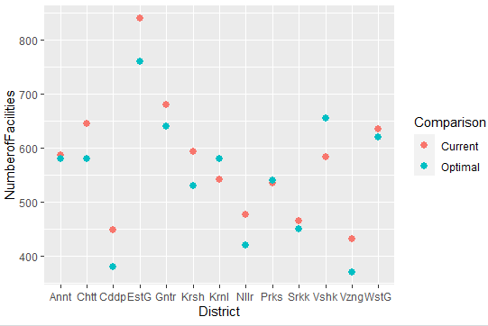
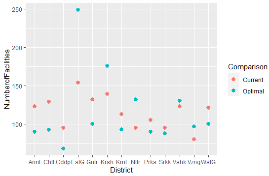
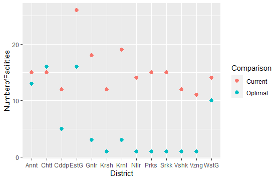
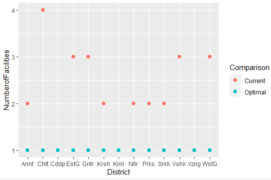

<h1 class="title toc-ignore">Optimizing capacity for state healthcare facilities</h1>

<h3 class="hasAnchor">Introduction</h3>

In this small study, I have tried to formulate the capacity of state 
healthcare facilities as a linear problem to try and optimize the 
capacity. By using real-world historical data, I have added certain 
constraints to model real-world scenarios. Finally, using a hypothetical
 cost model I have attempted to minimized the cost and compared the 
existing and proposed solutions. 

The study considers the data for a state, which is a unit of 
administration in India. Each state is further divided intro districts. A
 particular state is reponsible for managing its own healthcare 
facilities by running a number of facilities in each district. Thus, a 
state-level study can be useful for better allocation of resources.

A state has 4 main types of healthcare facilities with different size
 and medical procedure parameters. At the primary level, there are 
Sub-Centres (SC) and Primary Health Centres (PHCs). At the secondary 
level there are Community Health Centres (CHCs) and smaller Sub-District
 (SDH) hospitals. Finally, the top level of public care provided by the 
government is the tertiary level, which consists of Medical Colleges and
 District/General Hospitals(DH). More details about each are discussed 
below -

<h4 class="hasAnchor">Sub-Centers</h4>

Sub-centre is the first point of contact between the healthcare 
system and the public. The sub‐centers are equipped with basic drugs to 
treat the minor ailments and cater to the basic health needs of the 
community.

<h4 class="hasAnchor">Primary Health Centers</h4>

Primary Health Centre is the base layer of rural health services, a 
first point of appoach to a qualified doctor. Patients in rural areas 
who directly report or are referred from Sub-Centres for curative, 
preventive and promotive health care with 6 indoor/observation beds.

<h4 class="hasAnchor">Community Health Centres</h4>

The CHCs were designed to provide referral health care for cases from
 the Primary Health Centres level and for cases in need of specialist 
care approaching the centre directly. CHC is a 30-bedded hospital 
providing specialist care in Medicine, Obstetrics and Gynecology, 
Surgery, Paediatrics, Dental and AYUSH.

<h4 class="hasAnchor">Sub-District Hospitals</h4>

Sub-district (Sub-divisional) hospitals are below the district and 
above the block level (CHC) hospitals and act as First Referral Units 
for the Tehsil/Taluk/block population in which they are geographically 
located. With a varying strength of number of beds ranging from 31 to 
100 beds, they play an important role in providing emergency obstetrics 
care and neonatal care and help in bringing down the Maternal Mortality 
and Infant Mortality.

<h4 class="hasAnchor">District Hospitals</h4>

District hospital is an essential component of the health system 
which provides curative, preventive and promotive healthcare services to
 the people in the district. With a capacity of 101 to 500 beds, Various
 specialists like surgeon, physician, obstetrician and gynaecologist, 
paediatrician, orthopaedic surgeon, ophthalmologist, anaesthetist,ENT 
specialist and dentist are made available in the district hospital.

<h3 class="hasAnchor">Study Methodology</h3>

In this study, we have formulated the problem as a linear problem in 
Minizinc. The decision variables have been chosen as the number of 
facilities of each type in each district. Then, I have added constraints
 to each decision variable to ensure that they adhere to real-world 
scenarios. Finally, by using a hypthetical cost-model we calculate the 
cost of the total allocation of medical facilities and try to minimize 
it.

In the following sections, we delve deeper into each aspect of the study.

<h3 class="hasAnchor">Input data</h3>
<ul>
<li>
Source: data.gov.in
</li>
<li>
In the data retrieved from the above source the total facility 
types recorded are 5 (SC, PHC, CHC, SDH, DH) and the total issue types 
recorded are 7 (Allopathic- Outpatient attendance, Ayush - Outpatient 
attendance, C -Section deliveries at facility, Deliveries conducted at 
facility, IPD Attendance, Operation major (General and spinal 
anaesthesia), Operation minor (No or local anaesthesia) )
</li>
<li>
Total number of districts in Andhra Pradesh are 13 (Anantapur, 
Chittoor, Cuddapah, EastGodavari, Guntur, Krishna, Kurnool, Nellore, 
Prakasam, Srikakulam, Vishakapatnam, Vizianagaram, WestGodavari)
</li>
<li>
The data has total number of facilities for each facility type 
across each district in Andhra Pradesh for the period April 2019 to 
March 2020.
</li>
<li>
It also has the monthly average of number of issues of each issue
 type handled by each facility across each district in Andhra Pradesh 
for the period April 2019 to March 2020.
</li>
</ul>
<table class="table table-condensed">
<caption>Sample Input Data</caption>
<colgroup>
<col width="9%">
<col width="6%">
<col width="30%">
<col width="11%">
<col width="19%">
<col width="23%">
</colgroup>
<thead>
<tr class="header">
<th align="left">District</th>
<th align="left">Month</th>
<th align="left">IssueType</th>
<th align="left">FacilityType</th>
<th align="right">TotalNo.ofFacilities</th>
<th align="right">OverallAveragePerformance</th>
</tr>
</thead>
<tbody>
<tr class="odd">
<td align="left">Anantapur</td>
<td align="left">Apr-19</td>
<td align="left">Deliveries conducted at facility</td>
<td align="left">CHC</td>
<td align="right">15</td>
<td align="right">29</td>
</tr>
<tr class="even">
<td align="left">Anantapur</td>
<td align="left">Apr-19</td>
<td align="left">Deliveries conducted at facility</td>
<td align="left">DH</td>
<td align="right">1</td>
<td align="right">254</td>
</tr>
<tr class="odd">
<td align="left">Anantapur</td>
<td align="left">Apr-19</td>
<td align="left">Deliveries conducted at facility</td>
<td align="left">PHC</td>
<td align="right">123</td>
<td align="right">8</td>
</tr>
<tr class="even">
<td align="left">Anantapur</td>
<td align="left">Apr-19</td>
<td align="left">Deliveries conducted at facility</td>
<td align="left">SC</td>
<td align="right">586</td>
<td align="right">6</td>
</tr>
<tr class="odd">
<td align="left">Anantapur</td>
<td align="left">Apr-19</td>
<td align="left">Deliveries conducted at facility</td>
<td align="left">SDH</td>
<td align="right">2</td>
<td align="right">196</td>
</tr>
</tbody>
</table>
<ul>
<li>We added another column, which is the maximum of the monthly average
 values for each facility type. This gives us the maximum number of 
monthly cases handled at a particular facility in a year.</li>
</ul>
<table class="table table-condensed">
<caption>Sample Modified Data used for Analysis</caption>
<thead>
<tr class="header">
<th align="left">District</th>
<th align="left">IssueType</th>
<th align="left">FacilityType</th>
<th align="right">TotalNo.ofFacilities</th>
<th align="right">maxMonthValue</th>
</tr>
</thead>
<tbody>
<tr class="odd">
<td align="left">Anantapur</td>
<td align="left">Deliveries conducted at facility</td>
<td align="left">CHC</td>
<td align="right">15</td>
<td align="right">33</td>
</tr>
<tr class="even">
<td align="left">Anantapur</td>
<td align="left">Deliveries conducted at facility</td>
<td align="left">DH</td>
<td align="right">1</td>
<td align="right">277</td>
</tr>
<tr class="odd">
<td align="left">Anantapur</td>
<td align="left">Deliveries conducted at facility</td>
<td align="left">PHC</td>
<td align="right">123</td>
<td align="right">8</td>
</tr>
<tr class="even">
<td align="left">Anantapur</td>
<td align="left">Deliveries conducted at facility</td>
<td align="left">SC</td>
<td align="right">586</td>
<td align="right">10</td>
</tr>
<tr class="odd">
<td align="left">Anantapur</td>
<td align="left">Deliveries conducted at facility</td>
<td align="left">SDH</td>
<td align="right">2</td>
<td align="right">196</td>
</tr>
</tbody>
</table>
<ul>
<li>
Cost: To optimize the number of facilities, we have taken a 
hypothetical cost with an incremental ratio of 10 across the facility 
types. SC: 1, PHC: 10, CHC: 100, SDH: 1000, DH: 10000
</li>
<li>
Population: The rural population of all districts in Andhra Pradesh(Census 2011)
</li>
</ul>

<h3 class="hasAnchor">Constraints</h3>
<ul>
<li>
The decision variable is the optimal number of facilities of each facility type for each district.
</li>
<li>
The optimal number of SCs and PHCs (primary health facilities) 
are greater than the minimum required as per the rural population (As 
per IPHS Guidelines) in each district.
</li>
<li>
The capacity of each facility type for each issue type is taken 
as the maximum issues handled across all districts in the period April 
2019 to March 2020.
</li>
<li>
The total capacity (Capacity * optimal number of facilities) for 
each district for each issue type is greater than the total issues 
handled (maximum issues handled * current number of facilities ) for the
 period Apriil 2019 to March 2020.
</li>
<li>
The aim of the optimization is to get the optimal number of facilities, ensuring minimum cost.
</li>
</ul>

<h3 class="hasAnchor">Results</h3>
<ul>
<li>
With the optimal number of facilities, we see a 18.89% reduction in cost as compared to the current number of facilities.
</li>
<li>
We can infer from the optimal values, that the government should 
focus more on the primary health facilities in order to provide good 
health care service to the people.
</li>
<li>
The budget that is saved from this reduction of cost can further be used to provide better facilities at the primary level.
</li>
<li>
Please note that this cost reduction is based on the hypothetical
 cost model we have considered for this study. By using the actual costs
 for the health facilities, we could see different optimal results.
</li>
<li>
The plots comparing the current number of facilities and the 
optimal number of facilities for each facility type, across the 
districts are listed below -
</li>
</ul>

SC 

PHC 

CHC 

SDH 

DH 

<h3 class="hasAnchor">References</h3>
<ul>

<li>
<a href="https://github.com/monicaguntur/monicaguntur.github.io/tree/main/code">Minizinc Code and Input Data</a>
</li><li>
<a href="https://nrhm-mis.nic.in/hmisreports/frmstandard_reports.aspx">Indian Health Management Information System - Input Data</a>
</li><li>
<a href="https://nhm.gov.in/images/pdf/guidelines/iphs/iphs-revised-guidlines-2012/sub-centers.pdf">Indian Public Health Standards (IPHS) Guidelines for Sub-Centres Revised 2012</a>
</li>
<li>
<a href="https://nhm.gov.in/images/pdf/guidelines/iphs/iphs-revised-guidlines-2012/primay-health-centres.pdf">Indian Public Health Standards (IPHS) Guidelines for Primary Health Centres Revised 2012</a>
</li>
<li>
<a href="https://nhm.gov.in/images/pdf/guidelines/iphs/iphs-revised-guidlines-2012/community-health-centres.pdf">Indian Public Health Standards (IPHS) Guidelines for Community Health Centres Revised 2012</a>
</li>
<li>
<a href="https://nhm.gov.in/images/pdf/guidelines/iphs/iphs-revised-guidlines-2012/sub-district-sub-divisional-hospital.pdf">Indian Public Health Standards (IPHS) Guidelines for Sub-District/Sub-Divisional Hospitals(31 to 100 Bedded) Revised 2012</a>
</li>
<li>
<a href="https://nhm.gov.in/images/pdf/guidelines/iphs/iphs-revised-guidlines-2012/district-hospital.pdf">Indian Public Health Standards (IPHS) Guidelines for District Hospitals (101 to 500 Bedded) Revised 2012</a>
</li>
<li>
<a href="https://www.censusindia.gov.in/pca/Searchdata.aspx">Rural Population Census 2011</a>
</li>
</ul>

